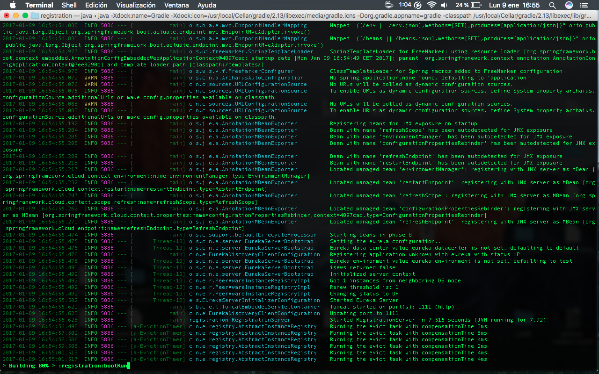

#The two microservices are running and registered (two terminals, logs screenshots).

#The service registration service has the two microservices registered (a third terminal, dashboard screenshots)

#A second account microservice is running in the port 4444 and it is registered (a fourth terminal, log screenshots).

#A brief report describing what happens when you kill the microservice with port 2222. Can the web service provide information about the accounts? Why?
When our microservice is closed, it returns an error message, and it asks the register service in order to obtain a working account service.
